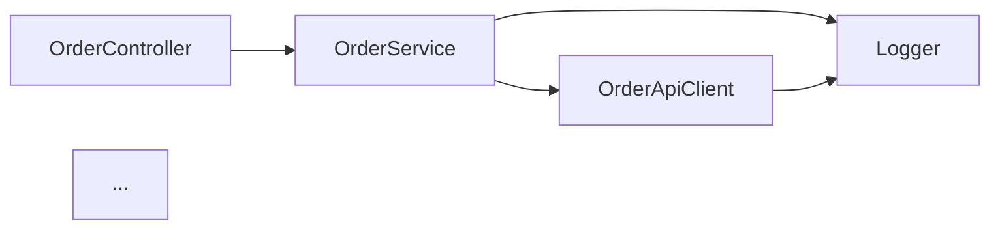
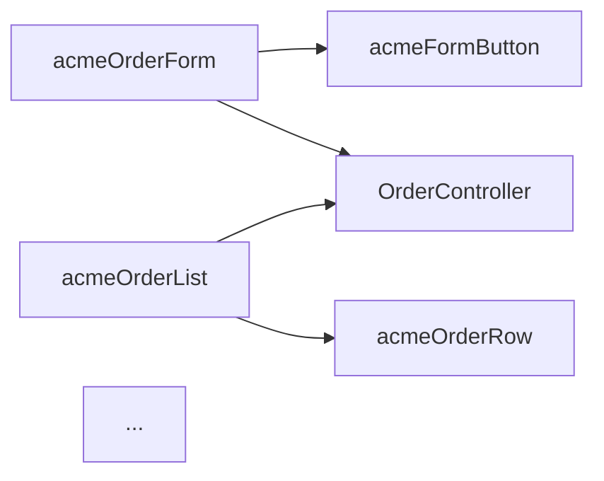

You are building a **dependency graph** of the project's source code so impact-analysis questions become quick to answer.

## Read Project Config First

```bash
source "${CLAUDE_PLUGIN_ROOT}/hooks/lib/config.sh"
APEX_SRC="$(sf_config_get '.paths.apexSource' "$ENV")"
LWC_SRC="$(sf_config_get '.paths.lwcSource' "$ENV")"
```

## Input

`$ARGUMENTS`:
- (empty) — build the full graph
- `apex` — Apex call graph only
- `lwc` — LWC import graph only
- `<symbol>` — focused subgraph: predecessors and successors of `<symbol>` (e.g., `OrderService` or `acmeOrderForm`)
- `--depth <n>` — when focused, how far to walk (default 2)
- `--out <path>` — output file (default `docs/diagrams/deps.md`)
- `--ci` — emit JSON edge list

## Steps

### Apex call graph

For each `.cls` and `.trigger`:
- Capture the class name and parent (extends) and interfaces
- For each method/property body, identify outgoing references:
  - `<OtherClassName>\.<member>` — call into another class
  - `new <OtherClassName>(` — instantiation
  - `\bextends\s+<OtherClass>` — inheritance
  - `\bimplements\s+<Interface>` — implementation
- Build edges `<thisClass> -> <otherClass>` (deduped per class pair)

### LWC import graph

For each LWC bundle:
- From the JS file, parse `import X from 'c/<lwcName>'` — edge `<thisLwc> -> <otherLwc>`
- From the HTML, parse `<c-<kebab-case>>` — edge `<thisLwc> -> <otherLwc>` (same as JS imports usually)
- From the JS, parse `import X from '@salesforce/apex/<Class>.<method>'` — edge `<thisLwc> -> <Class>` (cross into Apex)

### Focused subgraph

If a `<symbol>` is provided:
- Find the node in the graph
- Walk predecessors (up): callers of `<symbol>`
- Walk successors (down): things `<symbol>` calls
- Both bounded by `--depth`

### Output

Default Markdown (full graph):
```markdown
# Dependency Graph: <project.name>

Generated: 2026-04-28T15:30:00Z (`/sf-dev-kit:dependency-graph`)
Apex classes: 47 | LWC bundles: 18 | Cross-edges: 42

## Apex call graph



## LWC import graph (with Apex calls)



## Highly-connected nodes (most callers)

| Node | Type | Caller count |
|------|------|--------------|
| Logger | Apex | 22 |
| OrderService | Apex | 8 |
| acmeFormButton | LWC | 5 |
| ...
```

CI mode JSON edge list:
```json
{
  "nodes": [
    {"id": "OrderController", "type": "ApexClass", "file": "..."},
    {"id": "acmeOrderForm",   "type": "LightningComponentBundle", "file": "..."}
  ],
  "edges": [
    {"from": "acmeOrderForm", "to": "OrderController", "kind": "lwc-imports-apex"},
    {"from": "OrderController", "to": "OrderService", "kind": "apex-calls-apex"}
  ]
}
```

## Exit codes
- 0 — graph emitted
- 2 — config error

## Rules

- **Approximate, not perfect.** Without a real AST, some indirect references (reflection, dynamic SOQL) are missed. Flag dynamic Apex sites in the JSON output with a `dynamic: true` flag
- **Don't include test classes by default.** Add `--include-tests` if you want them
- **Idempotent.** Same source → same graph. Sort edges deterministically
- **Cap focused-subgraph size.** Above 50 nodes the Mermaid graph is illegible; truncate with a note

## Consumers

- `@architect` and `@data-architect` use focused subgraphs to reason about refactor blast radius
- `/sf-dev-kit:dead-code` shares the graph-building logic to find zero-incoming-edge nodes
- `/sf-dev-kit:field-impact` uses LWC-to-Apex edges to find which LWCs depend on a controller that touches a given field
