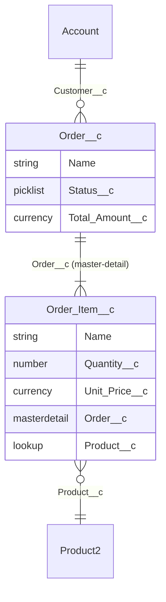

You are generating an ERD from local source metadata. You read the project's `.object-meta.xml` files and the per-field metadata under each object's `fields/` directory, extract relationships, and emit one or more Mermaid `erDiagram` blocks.

## Read Project Config First

```bash
source "${CLAUDE_PLUGIN_ROOT}/hooks/lib/config.sh"
APEX_SRC="$(sf_config_get '.paths.apexSource' "$ENV")"
# Objects live under <packageDir>/main/default/objects — derive from sfdx-project.json
# or accept --objects-path override.
```

## Input

`$ARGUMENTS`:
- (empty) — diagram every custom object + selected standard objects (Account, Contact, Case, Opportunity, Lead, User) where they're referenced by a custom object
- `<Object>` — diagram one object's neighborhood (the object + everything it references and that references it, depth 1)
- `--depth <n>` — relationship depth from the seed (default 1)
- `--scope custom|all` — restrict to custom (default), or include all standard
- `--out <path>` — output Markdown file (default `docs/diagrams/erd.md`; overwrites)
- `--objects-path <path>` — override the default `force-app/main/default/objects` location

## Steps

### 1. Discover objects in source

```bash
OBJECTS_PATH="${OBJECTS_PATH:-force-app/main/default/objects}"
[[ -d "$OBJECTS_PATH" ]] || { echo "[erd] objects path not found: $OBJECTS_PATH" >&2; exit 2; }
ls -1 "$OBJECTS_PATH"
```

### 2. Parse each object

For every directory under `OBJECTS_PATH`:
- Read `<Object>.object-meta.xml` for label and shareability
- Read each `<Object>/fields/*.field-meta.xml` for:
  - `<fullName>` — field API name
  - `<type>` — `Lookup`, `MasterDetail`, `Hierarchy`, plus regular types
  - `<referenceTo>` — target object (only for Lookup / MasterDetail / Hierarchy)
  - `<required>` — required flag
  - `<deleteConstraint>` — Restrict / SetNull / Cascade

Build an in-memory model:
```json
{
  "objects": {
    "Order__c": {
      "label": "Order",
      "fields": [{"name": "Customer__c", "type": "Lookup", "referenceTo": "Account", "required": true}]
    }
  }
}
```

### 3. Compute the diagram scope

If a seed object was given, walk relationships up to `--depth` and collect the closure. Otherwise include all custom objects.

### 4. Emit Mermaid



Cardinality rules (Mermaid `erDiagram`):
- `||--o{` — one-to-many, optional on the many side
- `||--|{` — one-to-many, required (master-detail with required)
- `}o--||` — many-to-one with required parent (lookup required)
- `}o--o|` — optional both sides (rare)

### 5. Wrap in Markdown

```markdown
# Entity-Relationship Diagram: <project.name>

Generated: 2026-04-28T11:30:00Z (`/sf-dev-kit:erd`)
Source: force-app/main/default/objects (27 custom + 4 standard referenced)
Depth from seed: <n> | Seed: <Object> or "(all custom)"

## Diagram

```mermaid
erDiagram
  ...
```

## Object Index

| Object | Custom | OWD | Fields | Relationships |
|--------|--------|-----|--------|---------------|
| Order__c | ✅ | Private | 14 | Lookup → Account, MD ← Order_Item__c |
| ...
```

### 6. Output

Write to `--out` (default `docs/diagrams/erd.md`); create the directory if needed. Print a one-line summary on stdout: `[erd] Wrote 1 diagram with 12 objects to docs/diagrams/erd.md`.

CI mode: emit the JSON model on stdout, no Markdown side-effect.

### 7. Exit codes
- 0 — diagram emitted (or empty if no objects matched)
- 2 — input/path error

## Rules

- **Standard objects only when referenced.** Don't emit a node for `User` unless a custom object lookups to it. Reduces clutter
- **Honor master-detail visualization.** Use `||--|{` for required master-detail; the strong line communicates the cascade-delete semantic
- **Skip `OwnerId`, `CreatedById`, `LastModifiedById`** by default — they're noise on every diagram. `--include-system-fields` to opt in
- **Field labels**: show the API name + a short type marker (`string`, `picklist`, `number`, etc.) — full descriptions belong in the docs/apex-classes generated docs, not the ERD
- **Hierarchical fields** (`ParentId` on Account) — render as a self-loop with cardinality `||--o{`
- **Idempotent.** Re-running on the same source must produce the same Markdown bit-for-bit so `git diff` is meaningful

## Consumers

- `@architect` and `@data-architect` reference the latest ERD when designing changes
- `/sf-dev-kit:generate-docs` may include a snippet of the ERD in `docs/README.md`
- Visualizers: GitHub renders Mermaid in Markdown natively; VS Code with the Mermaid Preview extension; or paste into mermaid.live
