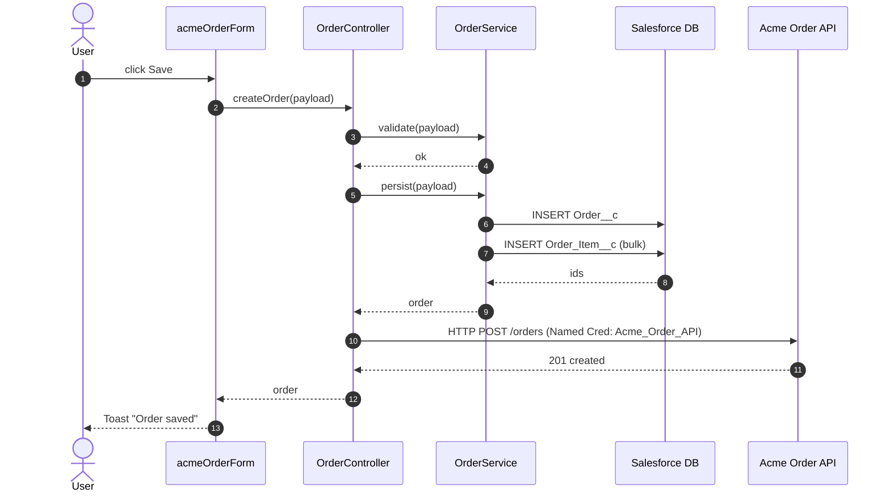

You are generating a Mermaid `sequenceDiagram` from the call path that begins at an LWC entry point (a button click, a `@wire`, a `connectedCallback`) and follows through Apex into the org and any external systems.

## Read Project Config First

```bash
source "${CLAUDE_PLUGIN_ROOT}/hooks/lib/config.sh"
LWC_SRC="$(sf_config_get '.paths.lwcSource' "$ENV")"
APEX_SRC="$(sf_config_get '.paths.apexSource' "$ENV")"
```

## Input

`$ARGUMENTS`: required.
- `<lwc-name>` — the LWC bundle name (without prefix); the skill traces from this component
- `<lwc-name>.<method>` — start from a specific JS method (e.g., `acmeOrderForm.handleSave`)
- `--out <path>` — output Markdown file (default `docs/diagrams/<lwc>.sequence.md`)
- `--max-depth <n>` — how many Apex method levels to follow (default 4)

## Steps

### 1. Locate the LWC

```bash
LWC_DIR="${LWC_SRC}/${LWC_NAME}"
[[ -d "$LWC_DIR" ]] || { echo "[seq] LWC not found: $LWC_DIR" >&2; exit 2; }
JS_FILE="${LWC_DIR}/${LWC_NAME}.js"
HTML_FILE="${LWC_DIR}/${LWC_NAME}.html"
```

### 2. Parse the LWC for entry points and Apex imports

From `<lwc>.js`:
- Extract Apex imports: `import <name> from '@salesforce/apex/<Class>.<Method>';`
- Extract LMS channel imports: `import ch from '@salesforce/messageChannel/<Channel>__c';`
- Extract `@wire` configs (Apex method + parameters)
- Extract event handler methods (matched against `<button onclick={X}>` in HTML)

If the user passed `<lwc>.<method>`, narrow to the call paths originating from that method.

### 3. Walk Apex methods

For each top-level Apex call:
- Read `${APEX_SRC}/<Class>.cls`
- Locate the method
- Inside the method, identify:
  - SOQL queries (`[SELECT ...]`)
  - DML (`insert`, `update`, `delete`, `upsert`, `merge`)
  - Callouts (`Http.send`, `WebServiceCallout.invoke`)
  - Platform Event publishes (`EventBus.publish`)
  - Method calls into other classes — recurse up to `--max-depth`
  - LMS publishes / subscribes (rare in Apex; mostly LWC)

Build a call tree:
```
acmeOrderForm.handleSave (LWC)
└─ OrderController.createOrder (Apex)
   ├─ OrderService.validate
   ├─ OrderService.persist
   │  ├─ INSERT Order__c
   │  └─ INSERT Order_Item__c (×N)
   └─ OrderApiClient.notify
      └─ HTTP POST callout:Acme_Order_API/orders
```

### 4. Emit Mermaid sequence



Conventions:
- `actor User` for the human triggering the flow
- `participant LWC as <component>` for the LWC bundle
- `participant <Short> as <FullClassName>` for each Apex class
- `participant DB as Salesforce DB` for SOQL/DML
- `participant Ext as <External System>` for each external endpoint (one per Named Credential)
- Use `->>` for synchronous / blocking; `-)>` for async (Queueable enqueue, Platform Event publish, async DML)
- Use `autonumber` to make steps citable in reviews

### 5. Wrap in Markdown

```markdown
# Sequence: <LWC>.<method>

Generated: 2026-04-28T11:45:00Z (`/sf-dev-kit:sequence-diagram`)
Entry: <LWC> (handler: <method>)
Depth: <n>

## Diagram

```mermaid
sequenceDiagram
  ...
```

## Call Tree

(text version of the call tree built in step 3, for accessibility)

## Notes

- Includes async transitions (Queueable, Platform Event) marked with `-)>`
- Excludes calls into the project's `Logger` and trigger handler dispatcher (omitted as plumbing)
- DML outside the Apex method scope (e.g., trigger side-effects) is not represented; rerun against the trigger to see those flows
```

### 6. Output

Write to `--out` (default `docs/diagrams/<lwc>.sequence.md`).

CI mode: emit JSON call tree on stdout, no Markdown side-effect.

### 7. Exit codes
- 0 — diagram emitted
- 1 — entry-point LWC has no Apex calls (informational; emit empty diagram)
- 2 — LWC not found / parse error

## Rules

- **Don't follow into framework code.** Stop at TriggerDispatcher, Logger, base controllers — they're plumbing
- **Bundle DML as one step.** "INSERT Order_Item__c (bulk)" is more useful than 200 lines of step
- **Use Named Credential names**, not URLs. `callout:Acme_Order_API` reads better than `https://api.acme.com`
- **Mark async clearly.** `-)>` for fire-and-forget (Queueable, Platform Event), separate participant `Q as Queueable` for delayed work that has its own subsequent flow
- **Idempotent output.** Same source → same Markdown
- **Imperfect is okay.** Apex parsing without a real AST is heuristic; flag any method calls you can't resolve as `??` and let the user inspect
